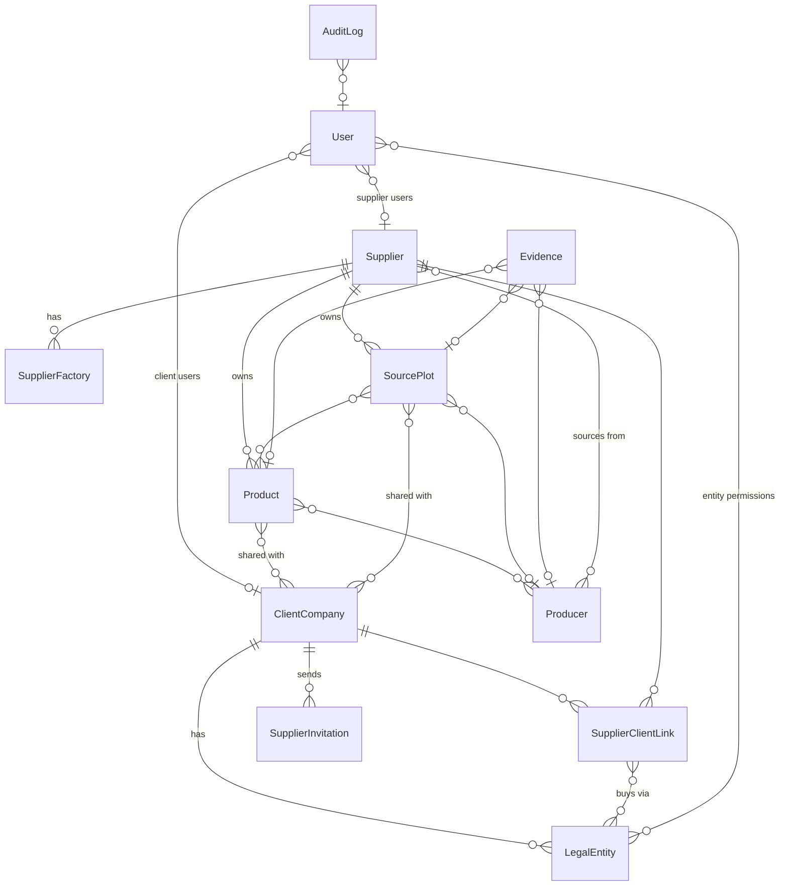

# SustainZone EUDR Gateway

Multi-company EUDR compliance platform that sits **alongside** a client's existing ERP / procurement
system. Suppliers provide EUDR information once through the Gateway; routine cases will be filtered
automatically and SustainZone will handle exceptions, risk review and new DDS requirements.

**Current state: Stage 1 (foundation) complete and tested.** See "Build stages" below for what is
and is not built yet. Nothing in the application simulates screening, DDS or TRACES results.

---

## 1. Architecture

A modular monolith: one Django application, one PostgreSQL + PostGIS database, server-rendered pages
with small, focused JavaScript where interaction matters (the map).

```
Browser (HTML + Leaflet map)
        │  session cookie, CSRF
        ▼
Django  ── accounts  (users, roles, invitations, login rate limiting)
        ── tenancy   (client companies, legal entities, suppliers, supplier↔client links, access scoping)
        ── supply    (producers, products, source plots + geometry, evidence files)
        ── audit     (append-only audit log)
        ── core      (dashboards, security headers, shared helpers)
        │
        ▼
PostgreSQL 16 + PostGIS 3.4        Private file storage (never publicly served)
```

Why this shape: a compliance tool needs strict consistency (DDS quantity ledger with row locking,
transactional workflows), spatial queries, and a very auditable permission model. A monolith keeps all
of that in one transaction boundary. Later stages add modules (`orders`, `screening`, `dds`, `cases`,
`integrations`) behind clear interfaces rather than services.

**Tenant isolation** lives in one file: `apps/tenancy/access.py`. Every view reads tenant data only
through `visible_*(user)` querysets and fetches objects with `get_object_or_404(scoped_queryset, pk=…)`,
so another tenant's record returns **404** (existence is not revealed). Mutations additionally require
a role (`@role_required`) and ownership.

**Supplier data sharing**: a supplier registers once and may serve many clients. Each product and source
location has an explicit "customers who can see this" list, so connecting to a second client never
exposes records shared with the first.

## 2. Technology stack

| Layer | Choice | Reason |
|---|---|---|
| Backend | Python 3.12, Django 5.1 | Mature auth, sessions, CSRF, migrations, forms/validation; GeoDjango for spatial |
| Database | PostgreSQL 16 + PostGIS 3.4 | Relational integrity, row locks for DDS ledger, native geometry |
| Geometry | GEOS / GDAL / PROJ | Validation, equal-area (EPSG:6933) hectare calculation |
| Map | Leaflet 1.9.4 + Leaflet.draw 1.0.4, **self-hosted** | Draw/edit/delete polygons; no CDN dependency; strict CSP |
| Passwords | Argon2 | Current best-practice hashing |
| Tests | Django test runner (PostGIS test DB), Playwright browser journey | |
| Deploy | Docker / gunicorn; Redis recommended for rate limiting | |

## 3. Database design (Stage 1 tables)



Key points:
- `SourcePlot.geometry` is `MultiPolygon(SRID 4326)`, `SourcePlot.point` is `Point(4326)`; a DB check
  constraint requires one of them. Area is stored in hectares computed in an equal-area projection
  (verified to match PostGIS geodesic `ST_Area(geography)`).
- `User` has a DB check constraint tying role to tenant (SZ admin has none; client roles need a client;
  supplier roles need a supplier).
- Invitation tokens are 256-bit random; only the SHA-256 hash is stored; single use; expiry enforced.
- JSON is used only for audit before/after snapshots, never for business data.

Planned tables for later stages: `PurchaseOrder`, `PurchaseOrderLine`, `SupplierRequest` (+ status
history/reminders), `DueDiligenceStatement`, `DdsAllocation` (ledger, `SELECT … FOR UPDATE`),
`ScreeningProvider`, `GeospatialScreening`, `ScreeningFinding` (geometry), `FilterEvaluation`,
`ExceptionCase`, `RiskAssessment`, `MitigationAction`, `DdsActionRequest`, `TracesSubmission`,
`Notification`, `ApiClient`.

## 4. Project structure

```
config/            settings (env-based secrets), urls, wsgi
apps/accounts/     User, Role, UserInvitation, login rate limiting, team management, create_sz_admin command
apps/tenancy/      ClientCompany, LegalEntity, Supplier, SupplierFactory, SupplierClientLink,
                   SupplierInvitation, access.py (tenant scoping)
apps/supply/       Producer, Product, SourcePlot, Evidence, geo.py (GeoJSON validation, area)
apps/audit/        AuditLog (immutable), services.record()
apps/core/         dashboards, security headers middleware, nav, tokens, email
templates/         server-rendered pages
static/js/plot_map.js   map drawing / upload / coordinates
static/vendor/     Leaflet + Leaflet.draw (vendored)
tests_e2e/         Playwright browser journey
```

## 5. Build stages

| Stage | Scope | Status |
|---|---|---|
| 1 | Login, clients, entities, supplier invitation & registration, products, producers, source plots with map drawing/upload, secure evidence, tenant isolation, audit | **Done, tested** |
| 2 | PO workflow: supplier enters PO lines against registered data; supplier request statuses; reminders → Compliance Hold; notifications | Next |
| 3 | Geospatial screening provider framework + map overlays; first real provider (EU country risk classification); JRC GFC2020 / TMF / WorldCover as rasters are connected; findings drawn on the same map | |
| 4 | DDS records, automated coverage matching, DDS quantity ledger with transactional allocation | |
| 5 | Guided evidence collection for No / Not Sure; incomplete-information loop | |
| 6 | Rules-based filter (GREEN/AMBER/RED), exception queue, review page, risk assessment, mitigation, new-DDS requests, manual TRACES recording + integration interface | |
| 7 | Search across records, CSV/Excel reports, client status API (token auth) | |

## 6. Running locally

With Docker (recommended). Start Docker Desktop, then from this folder:

- Windows PowerShell: `.\start.ps1` (stop: `.\stop.ps1`)
- macOS / Linux / WSL: `./start.sh` (stop: `./stop.sh`)

The script stops any previous copy, picks the next free port if 8000 is in use, builds and starts
the app, asks you to create the SustainZone Admin on first run, and opens the browser.

Manual equivalent:
```bash
docker compose up --build
docker compose exec web python manage.py create_sz_admin --email you@sustainzone.com --name "Your Name"
```

Without Docker (needs PostgreSQL with PostGIS, and GDAL installed):
```bash
pip install -r requirements.txt
createdb eudr && psql -d eudr -c "CREATE EXTENSION postgis;"
cp .env.example .env && set -a && . ./.env && set +a
python manage.py migrate
python manage.py create_sz_admin --email you@sustainzone.com --name "Your Name"
python manage.py runserver
```

Invitation emails print to the server console until SMTP is configured; the invitation link is also
shown once to the person who sent it.

### Free online test deployment
See `DEPLOY_RENDER.md` (Render free web service + free PostGIS database via `render.yaml`).

### Tests
```bash
python manage.py test apps                 # 22 tests: full journey, isolation, security, GeoJSON validation
python tests_e2e/stage1_browser_journey.py  # real browser; server running on :8000
```

## 7. Stage 1 verification (what was actually run)

- `manage.py check`, migrations, `makemigrations --check`: clean.
- 22 automated tests passing against PostGIS, including the complete journey
  (SZ admin → client → entity → invite supplier → supplier registers → producer → product → source plot
  polygon → reload → client views supplier / product / map → SZ sees all → a second client gets 404 on
  every record and sees nothing in lists), per-client sharing by a multi-client supplier, entity-user
  restrictions, evidence download permissions, disguised-file rejection, expired/used invitations,
  login rate limiting, Argon2 hashing, CSRF, role/tenant DB constraint, CSP headers.
- Browser journey in headless Chrome: polygon drawn by mouse on the map, saved, reopened for editing,
  replaced by an uploaded two-polygon GeoJSON, invalid pasted GeoJSON rejected without losing the
  existing shape, client viewing the same map read-only. Desktop and 390 px mobile layouts checked.

## 8. Security notes and production checklist

Implemented: Argon2 hashing, 12+ character password validation, secure/HttpOnly/SameSite cookies
(when `DJANGO_DEBUG=0`), 8-hour sessions ending at browser close, CSRF on all forms, login rate limiting,
role + object-level checks, 404 for cross-tenant access, strict Content-Security-Policy (all scripts
self-hosted), HSTS/SSL redirect in production, evidence stored outside any public URL with type/size/
magic-byte validation and SHA-256, audit of downloads and all significant changes, secrets from environment.

Before production: configure SMTP, Redis (`REDIS_URL`) so rate limits are shared across workers,
object storage with encryption at rest for evidence (swap Django storage backend), antivirus scanning of
uploads, database backups, MFA for SustainZone and client admins, and a static file server.

## 9. Known limitations of Stage 1 (deliberate)

- No geospatial screening, DDS, PO, filtering or TRACES functionality exists yet; the UI says so where
  those results would appear rather than showing placeholders.
- Map tiles use OpenStreetMap and Esri World Imagery public tile services; review their usage terms for
  production volume or switch to a commercial/self-hosted tile provider.
- Browser area figures while drawing are approximate; the saved area is calculated server-side.
- Supplier Users can upload evidence; request-completion permissions arrive with Stage 2.
